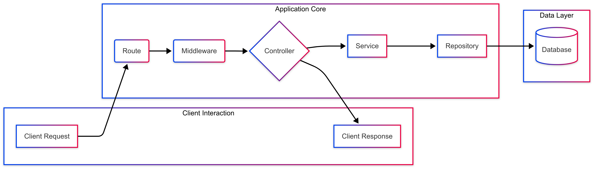

## Project Structure

This project is structured to support a scalable Node.js backend application. Key features of the structure include:

- **Layered Architecture:** Code is organized into layers for API handling (`src/api`), business logic (`src/services`), data access (`src/repositories`), and utilities (`src/utils`).
- **Configuration:** Application configuration is managed in the `config/` directory and through environment variables (`.env`).
- **Root Files:** Core startup (`server.js`), package management (`package.json`), and Docker configuration (`Dockerfile`, `docker-compose.yml`, `.dockerignore`) are located in the project root.
- **Modularity:** Distinct directories for `middlewares`, `sockets`, `db` (for database related files like migrations/seeds), and `tests` promote modular design.

## 🧱 Tech Stack

- Runtime: Node.js

- Framework: Express.js

- Database: PostgreSQL (managed via Sequelize ORM)

- Authentication: Bcrypt – for secure password hashing

- Validation: Joi– for request payload validation

- Containerization: Docker + Docker Compose – for consistent dev and production environments

- Testing: Jest (with mocking and unit tests)

- Realtime (planned): Socket.IO – for live updates and bi-directional communication

- Code Quality: Husky – pre-commit hooks for linting and test enforcement

## 🗂️ Project Structure

```
chatflow/
├── src/
│   ├── api/
│   │   ├── controllers/    # Route handlers (e.g., auth.controller.js)
│   │   └── routes/         # Express route definitions (e.g., auth.routes.js)
│   ├── services/           # Business logic (e.g., auth.service.js)
│   ├── repositories/       # Data access (e.g., user.repository.js)
│   ├── middlewares/        # Custom middleware (e.g., validation middleware)
│   └── utils/              # Helpers (e.g., password hashing)
├── db/
│   ├── models/             # Sequelize models
│   └── migrations/         # Sequelize migrations
├── config/                 # Sequelize config (config.json)
├── tests/                  # Test suites (unit, integration, common helpers)
│   └── unit/
│       ├── common/         # Shared mocks, helpers for unit tests
│       ├── controller/     # Tests for Express controllers (e.g., auth.controller.test.js)
│       ├── service/        # Tests for business logic (e.g., auth.service.test.js)
│       └── validation/     # Tests for request schema validation (e.g., auth.validation.test.js)
├── Dockerfile              # App container definition
├── docker-compose.yml      # Multi-container orchestration
├── .env                    # Environment variables
└── README.md               # Project documentation

```

## Application Architecture

The application follows a layered architectural pattern to ensure separation of concerns and maintainability. The typical request lifecycle is as follows:

1.  **Route (`src/api/routes/`)**: Defines the API endpoints and HTTP methods. It receives the incoming request.
2.  **Middleware (`src/middlewares/` & `src/utils/validators.js`)**: Functions that process the request before it reaches the controller. This includes:
    - Input validation (e.g., using Joi).
    - Authentication and authorization checks (to be added).
    - Logging, error handling, etc.
3.  **Controller (`src/api/controllers/`)**: Receives the validated request from the middleware. It parses the request (body, params, query), calls the appropriate service layer function to handle the business logic, and then formats and sends the HTTP response (data or error) back to the client.
4.  **Service (`src/services/`)**: Contains the core business logic of the application. It orchestrates operations, performs calculations, and interacts with the repository layer for data access. It's kept independent of the HTTP layer.
5.  **Repository (`src/repositories/`)**: Abstracts the data access logic. It's responsible for all direct interactions with the database (e.g., querying, creating, updating, deleting records). This layer allows the service layer to be independent of the specific database technology or ORM being used.
6.  **Database**: The persistent storage for the application. (Currently in-memory for `UserRepository`, with plans for PostgreSQL).

Here's a visual representation using a Mermaid diagram:



This diagram shows the request flowing from the client to the Route, through Middleware to the Controller. The Controller uses the Service, which in turn uses the Repository to interact with the Database. The Controller then sends a response back to the Client.

## 🚀 Node.js Backend Starter (Docker Dev Setup)

This is a Node.js backend project set up for local development using Docker and Docker Compose.

### 📦 Requirements

- [Docker](https://www.docker.com/products/docker-desktop)
- [Docker Compose](https://docs.docker.com/compose/)
- [Node.js]()
-

## 🛠️ Getting Started

### 1. Clone the Repository

```bash
git clone git@github.com:dawit-personal/chatFlow.git
cd chatFlow
```

### 2. Create a .env File

```env
MY_PORT=3000
NODE_ENV=development
```

### 3. Start the App with Docker Compose

```
docker compose up --build
```

This will

- Build and start the Express server
- Set up the PostgreSQL database
- Run migrations automatically

## API Usage

- Register: POST /auth/register

## Unit test

The app uses Jest for unit testing. Service and controller dependencies are mocked using jest.fn() or jest.mock() to ensure isolated testing of each component.

### 📁 Test Folder Structure

```
tests/
└── unit/
    ├── common/         # Shared test utilities, mocks, and helpers for unit tests
    ├── controller/     # Tests for Express controllers (e.g., auth.controller.test.js)
    ├── service/        # Tests for business logic (e.g., auth.service.test.js)
    └── validation/     # Tests for request schema validation (e.g., auth.validation.test.js)


```

### ▶️ How to Run the Tests

```
make test
```

This will:

- Run all Jest test files inside the Docker container.
- Use mocks to isolate controller and service tests.
- Show success/failure with detailed error output.

To run a specific test file:

```
docker compose exec app npx jest tests/unit/controller/auth.controller.test.js
```

## 🗄️ DB

The system uses Sequelize, a promise-based ORM for Node.js, to manage our PostgreSQL database. Sequelize simplifies database interaction through JavaScript objects and provides built-in support for migrations, model definitions, and associations, promoting maintainable and scalable database code.

All database migrations are run automatically inside the Docker container, ensuring consistent schema setup across all environments (local, staging, production). This setup allows for smooth CI/CD pipelines, reproducible builds, and better environment parity.

Sequelize was chosen for its balance of developer ergonomics, transaction support, and extensibility, making it a great fit for modern Node.js applications.

### ACID compliance

To ensure data consistency and reliability, we use database transactions when creating a new user and their associated profile.

🔄 ACID Principles Enforced by Transactions

- **Atomicity:** All steps inside the transaction either succeed together or fail together.
- **Consistency:** The database remains in a valid state before and after the transaction.
- **Isolation:** The transaction runs independently from others, preventing conflicts.
- **Durability:** Once committed, the changes persist even after system failure.

## 🐶 Code Quality Enforcement

Husky is a tool that lets you run scripts automatically before certain Git actions, like committing or pushing code. It hooks into Git using Git hooks, and lets you automate checks like linting, testing, formatting, etc.

Without Husky, you can accidentally commit broken, unformatted, or untested code. Husky ensures that scripts like lint, format, or test run before a commit is accepte

### Pre-commit hooks include:

- eslint for code quality
- prettier for consistent formatting
- jest (backend) for test coverage on changed files

### Usage

Just commit your code — Husky will automatically verify your changes by running unit tests on staged files.
If any existing test case breaks or a test related to your changes fails, the commit will be blocked. This ensures broken code doesn't enter the repository.

## Command

- `make up` – Build and start the application using Docker
- `make down` – Stop and remove Docker containers
- `make test` – Run unit tests inside the Docker container
- `migrate-up` – Run database migrations up
- `migrate-down` – Roll back the last database migration
- `npx sequelize-cli migration:generate --name your_migration_name` – to create a new Sequelize migration with a timestamped filename:
- `git commit --no-verify -m "feat(db): add centralized transaction handler with retry and post-commit support"` - skip tests in your pre-commit to unblock commits

tomorow Plan

- POSt auth/me end point
- make it mono repo
- front page
- nginx
- Socket io
- add more unit test
- Rabbit mq for profile image upload
