# Architecture Overview

## High Level system design

### Overview

Purpose: Real-time chat application (FlowChat) for users to exchange messages instantly.
Scope: Monorepo with frontend, backend, rtc, PostgreSQL, and Docker Compose.

FlowChat is a real-time chat application built as a monorepo with three services.

- **Backend** Express.js for REST APIs
- **Frontend** React + MUI for responsive, customizable UI
- **Real-time communication (RTC)** Socket.IO for real-time communication
- **Database** (Postgres for data persitance)
- **Orchestration** Docker Compose for local container management

### Functional Requirements

#### Backend

- Built with Express.js using a layered architecture: routes, controllers, services, and singleton repositories for efficient database access.
- Middleware handles CORS, JWT authentication, input validation, and rate limiting (express-rate-limit) to ensure security and reliability.
- Provides REST APIs for frontend and interacts with the RTC service for real-time messaging.
- Runs within Docker Compose for consistent development and deployment environments

#### Frontend

- Built with React and MUI for a responsive, customizable UI.
- Communicates with the backend via HTTP and the RTC service via WebSocket (Socket.IO) for real-time messaging.
- Loads environment variables from .env and runs as a Docker service for consistent development.

#### RTC

- uilt with Socket.IO to handle real-time communication between users.
- Manages events such as send_message, user_online, etc..
- Runs as a separate Docker service, enabling independent deployment and scaling.

#### Database

- PostgreSQL is used as the primary relational database to ensure data persistence for core entities such as users, chats, and messages
- The schema is normalized for consistency and optimized with indexes to support performant query operations (e.g., JOIN, WHERE, ORDER BY).
- Data is stored durably and reliably to ensure chat history and user records are not lost across deployments or system restarts.
- The system follows the ACID principles (Atomicity, Consistency, Isolation, Durability) to guarantee data integrity, especially in concurrent or failure-prone scenarios.

#### env

- Shared .env variables centralize configuration.

#### Docker compose

- Orchestrates multiple services (frontend, backend, RTC, and database) in isolated containers.
- Uses depends_on and health checks to control the startup sequence and ensure each service is ready before others depend on it.
- Configures auto-healing through Docker’s restart policies (e.g., restart: always) to automatically recover containers in case of failure. (dsiabled for now)
- Automates backend tasks like dependency installation and database migrations on startup.
- Enables consistent local development with shared .env configuration and persistent volumes.

### Non-Functional Requirements

#### Security

- JWT-based authentication for API access
- Rate limiting to mitigate abuse and brute-force attacks
- Input validation to prevent injection attacks
- Password policy aligned with SOC 2 compliance requirements
- Services communicate over internal Docker network (not exposed externally by default)
- CORS policy to restrict cross-origin requests

#### Scalibility

- rtc and backend can scale independently
- To Prevents overloading the server use pagination
- To speed Speeds up queries by making data easier to find use db indexing

### Reliability

- Reconnection logic in Socket.IO
- Rate limiting by preventing abuse and ensuring fair usage of server resources.
- The backend adheres to ACID principles (Atomicity, Consistency, Isolation, Durability), providing strong guarantees of data integrity, especially during concurrent operations or unexpected failures.

### Performance

- Using Indexes in a Database
  - to speed up data retrieval instead of full scan
  - faster ORDER BY, WHERE, and JOIN operations
- Use singleton pattern repository to avoid repeated instantiations

### Architecture Diagram



## Design Decisions

- **Monorepo structure** was chosen to streamline local development, testing, and deployment of tightly-coupled services.
- **Socket.IO** was preferred over raw WebSocket for its built-in fallback support and reconnection handling.
- **Docker Compose** was used for dev/local environments; the architecture is cloud-ready for container orchestration.

This system architecture enables modular development, reliability through reconnection and health checks, and readiness for production-grade deployments with containerization, centralized config, and scalable design. It is well-suited for small to medium-scale real-time chat applications.

## Technology choices and rationale

### Backend

- Node.js

  - Rationale
    - It is a non-blocking, single-threaded JavaScript runtime, making it ideal for I/O-heavy, real-time applications like chat systems.
    - Node.js works seamlessly with Socket.IO, which is built on top of its event-driven architecture, enabling efficient handling of WebSocket connections.
    - Using JavaScript across both frontend (React) and backend (Express + RTC) minimizes context switching and allows developers to work full-stack.
    - Its asynchronous, non-blocking I/O model helps handle thousands of concurrent connections with minimal overhead.
    - Over 112K stars on GitHub, vast NPM package ecosystem, and mature frameworks like Express and Sequelize for rapid backend development.
    - Developers can shift between frontend and backend roles more easily, supporting lean or fast-growing teams.

- Express.js

  - Rational
    - A minimal and flexible Node.js framework for the backend
    - Support layered architecture (routes, controllers, services, repositories)
    - Provides robust support for middleware, enabling easy implementation of features like authentication, input validation, logging, and rate limiting.
    - Small package size (~197 KB) with minimal overhead.
    - Actively developed and maintained with strong community engagement.
    - ~44 million weekly downloads on npm, making it one of the most popular and battle-tested Node.js web frameworks.

- PostgreSQL (managed via Sequelize ORM)

  - Rational
    - PostgreSQL is a powerful, open-source SQL database ideal for handling structured, relational data with strong consistency guarantees.
    - Supports complex queries, transactions, indexing, and constraints — essential for maintaining data integrity in multi-user chat systems.
    - Widely supported with mature documentation, active development, and extensive ecosystem support.

- ORM (Seqalize)

  - Rational
    - Provides a high-level, promise-based API to interact with relational databases like PostgreSQL — reducing the need to write raw SQL.
    - Enables easy definition of models, relationships, and validations using JavaScript, aligning with the backend architecture.
    - Speeds up development by simplifying complex query logic, relationships, and transactions.
    - Actively maintained with a rich ecosystem of plugins and community support.
    - : Sequelize is downloaded over 2 million times per week, reflecting its wide adoption and trust in the Node.js ecosystem.

- Validation (Joi)

  - Rational
    - Allows you to define clear, reusable schemas for validating request payloads, query parameters, and environment variables.
    - Pairs seamlessly with Express.js middleware to validate incoming HTTP requests before they reach your controllers.
    - Joi has over 12 million weekly downloads, making it one of the most popular and trusted validation libraries in the JavaScript ecosystem.

- Containerization: Docker + Docker Compose

  - Rational
    - Docker ensures that applications run the same way across development, testing, and production by packaging code with all dependencies.
    - Docker Compose simplifies managing multi-container applications by defining services, networks, and volumes in a single YAML file.
    - Developers can spin up the entire stack (backend, frontend, database, RTC) with one command, accelerating onboarding and testing.
    - Easy integration with CI/CD pipelines for automated builds, tests, and deployments.
    - Vast ecosystem with extensive tooling, documentation, and community support.

- Testing: Jest (with mocking and unit tests)

  - Rational
    - Supports unit tests, mocks, spies, snapshot testing, and coverage reporting out of the box.
    - Simple setup with zero configuration needed for most projects, and built-in support for asynchronous testing.
    - Works well with React, Node.js, and TypeScript, making it a go-to choice for full-stack JavaScript projects.
    - Over 33 million weekly downloads, with recent updates as recent as 12 hours ago, reflecting strong community support and active development.
    - small footprint (~5 KB) that runs tests quickly and efficiently.

- Real Time communication - Socket.IO

  - Rational
    - Enables bidirectional, low-latency communication using WebSockets with fallbacks for older browsers.
    - Works seamlessly with Node.js and Express, making it ideal for real-time features like chat, notifications, and live updates.
    - Built-in support for reconnection, multiplexing, and event-based communication simplifies development.
    - Can be extended with adapters like Redis for multi-instance setups.
    - Over 8 million weekly downloads, demonstrating strong adoption in real-time web applications.

- Code Quality: Husky
  - Rational
    - Simplifies managing Git hooks (e.g., pre-commit, pre-push) to automate tasks like linting, testing, and formatting.
    - Helps enforce code standards and prevent bad commits by running checks before changes are committed.
    - Simple setup and integration with popular tools like ESLint, Prettier, and Jest.
    - Over 17 million weekly downloads, reflecting wide adoption in JavaScript projects.
    - Small size (~4.4 KB) with minimal overhead and zero dependencies
- Git

  - Rational
    - Git is the most widely used distributed version control system, trusted by millions of developers worldwide.
    - Enables easy parallel development with lightweight branches and robust merge capabilities.
    - Tracks changes, supports collaborative workflows via platforms like GitHub and GitLab, and enables code reviews.
    - Seamlessly integrates with CI/CD pipelines, IDEs, and various developer tools.

- Makefile
  - Rational
    - Simplifies and Standardizes Development Workflow
    - Encapsulates Complex Commands & Cross-Platform Compatibility

## Database schema design

The database schema for FlowChat, a real-time chat application, is designed to manage users, their profiles, login sessions, chats, chat memberships, messages, and message statuses. It is implemented using PostgreSQL, managed via Sequelize ORM, and executed through Dockerized migrations for consistency and scalability.

- ACID compliance

🔄 ACID Principles Enforced by Transactions

- **Atomicity:** All steps inside the transaction either succeed together or fail together.
- **Consistency:** The database remains in a valid state before and after the transaction.
- **Isolation:** The transaction runs independently from others, preventing conflicts.
- **Durability:** Once committed, the changes persist even after system failure.

---

### Users

| Column    | Type   | Constraints                   |
| --------- | ------ | ----------------------------- |
| userId    | UUID   | Primary Key                   |
| email     | STRING | Unique                        |
| password  | STRING |                               |
| status    | ENUM   | active / inactive / suspended |
| createdAt | DATE   |                               |
| updatedAt | DATE   |                               |

**Indexes:** userId, email  
**Purpose:** Stores user accounts with secure authentication data.

---

### UserLogins

| Column       | Type    | Constraints                             |
| ------------ | ------- | --------------------------------------- |
| id           | INTEGER | Primary Key                             |
| userId       | UUID    | Foreign Key → Users                     |
| status       | ENUM    | active / revoked / expired / logged_out |
| accessToken  | TEXT    |                                         |
| refreshToken | TEXT    |                                         |
| ipAddress    | STRING  |                                         |
| userAgent    | STRING  |                                         |
| expiresAt    | DATE    |                                         |
| revoked      | BOOLEAN |                                         |
| createdAt    | DATE    |                                         |
| updatedAt    | DATE    |                                         |

**Indexes:** userId, refreshToken, revoked, expiresAt, (userId + revoked), (userId + expiresAt)  
**Purpose:** Tracks user login sessions and tokens for authentication.

---

### UserProfiles

| Column         | Type    | Constraints         |
| -------------- | ------- | ------------------- |
| profileId      | INTEGER | Primary Key         |
| userId         | UUID    | Foreign Key → Users |
| firstName      | STRING  |                     |
| lastName       | STRING  |                     |
| profilePicture | STRING  |                     |
| createdAt      | DATE    |                     |
| updatedAt      | DATE    |                     |

**Indexes:** firstName (GIN trigram index)  
**Purpose:** Stores optional user profile details.

---

### Chats

| Column    | Type    | Constraints         |
| --------- | ------- | ------------------- |
| id        | INTEGER | Primary Key         |
| userId    | UUID    | Foreign Key → Users |
| isGroup   | BOOLEAN |                     |
| name      | STRING  |                     |
| createdAt | DATE    |                     |
| updatedAt | DATE    |                     |

**Indexes:** userId, name, (userId + name)  
**Purpose:** Represents chat entities (one-on-one or group).

---

### ChatMembers

| Column   | Type    | Constraints         |
| -------- | ------- | ------------------- |
| id       | INTEGER | Primary Key         |
| userId   | UUID    | Foreign Key → Users |
| chatId   | INTEGER | Foreign Key → Chats |
| joinedAt | DATE    |                     |

**Indexes:** chatId, userId, joinedAt, (chatId + userId unique)  
**Purpose:** Manages user participation in chats.

---

### Messages

| Column       | Type    | Constraints                 |
| ------------ | ------- | --------------------------- |
| id           | INTEGER | Primary Key                 |
| chatId       | INTEGER | Foreign Key → Chats         |
| senderUserId | UUID    | Foreign Key → Users         |
| content      | TEXT    |                             |
| messageType  | ENUM    | text / image / video / file |
| timestamp    | DATE    |                             |
| isRead       | BOOLEAN |                             |

**Indexes:** chatId, senderUserId, timestamp, (chatId + timestamp)  
**Purpose:** Stores chat messages with metadata.

---

### MessageStatuses

| Column    | Type    | Constraints             |
| --------- | ------- | ----------------------- |
| id        | INTEGER | Primary Key             |
| messageId | INTEGER | Foreign Key → Messages  |
| userId    | UUID    | Foreign Key → Users     |
| status    | ENUM    | sent / delivered / read |
| updatedAt | DATE    |                         |



## API design decisions

### Overview

The API for FlowChat, a real-time chat application, is designed to enable seamless interaction between the frontend (React) and backend (Express) services within a monorepo, orchestrated by Docker Compose. It follows RESTful principles, integrates with PostgreSQL (via Sequelize), and supports real-time features via Socket.IO, catering to scenarios like User X messaging User Y.

### Key Design Decisions

#### RESTful Architecture

- RESTful Architecture

  - Rational

    - Follows REST principles with resource-based endpoints (e.g., /users, /chats) to provide a clear, standardized, and predictable API structure. This simplifies frontend integration, aligns with web standards, and improves scalability and maintainability.

  - Versioning (not done here - it should be included in the next release)

    - Rational
      - Implements URL versioning (e.g., /v1/users) to enable seamless future API updates (e.g., /v2) without disrupting existing clients, supporting backward compatibility and long-term maintainability.

  - Endpoint Structure

    - Rational
      - Hierarchical and resource-oriented, reflecting the database schema (Users, Chats, Messages) and supporting CRUD operations.

  - Authentication
    - Rational
      - Implements JWT-based authentication with Bcrypt for password hashing. Endpoints require a valid accessToken in the Authorization header, ensuring secure user access (e.g., User X authenticates before sending messages).
  - Validation

    - Rational
      - Uses Joi middleware to validate request payloads (e.g., email, password in POST /v1/users), enhancing security and reducing invalid data errors.

  - Error Handling
    - Rational
      - Returns standardized JSON responses (e.g., { error: "Unauthorized", status: 401 }) with HTTP status codes (400, 401, 404, 500), improving frontend error management and debugging.
  - Rate Limiting
    - Rational
      - Applies express-rate-limit middleware (e.g., 100 requests/15min per IP) to prevent abuse
  - Response Format (need improvement)
    - Rational
      - ses consistent JSON responses (e.g., { data: {...}, status: "success" }) to streamline frontend parsing and support future extensions.

---

# Additional Info

## Unit test

The app uses Jest for unit testing. Service and controller dependencies are mocked using jest.fn() or jest.mock() to ensure isolated testing of each component.

### 📁 Test Folder Structure

```
tests/
└── unit/
    ├── common/         # Shared test utilities, mocks, and helpers for unit tests
    ├── controller/     # Tests for Express controllers (e.g., auth.controller.test.js)
    ├── service/        # Tests for business logic (e.g., auth.service.test.js)
    └── validation/     # Tests for request schema validation (e.g., auth.validation.test.js)
```

### ▶️ How to Run the Tests

From the project root, run

```
make test
```

## 🐶 Code Quality Enforcement with Husky

Code quality is enforced using Husky. Before every commit, Husky automatically runs unit tests on staged files and linting before each commit:

- If any test fails, the commit will be blocked.
- This ensures that broken or unverified code doesn't get pushed to the repository.

### Usage

- Stage your changes:

```
make add
```

- Commit with a message:

```
make commit m="Your message" d="Optional description
```

Behind the scenes, Husky will trigger Jest to verify the changes before the commit goes through.
